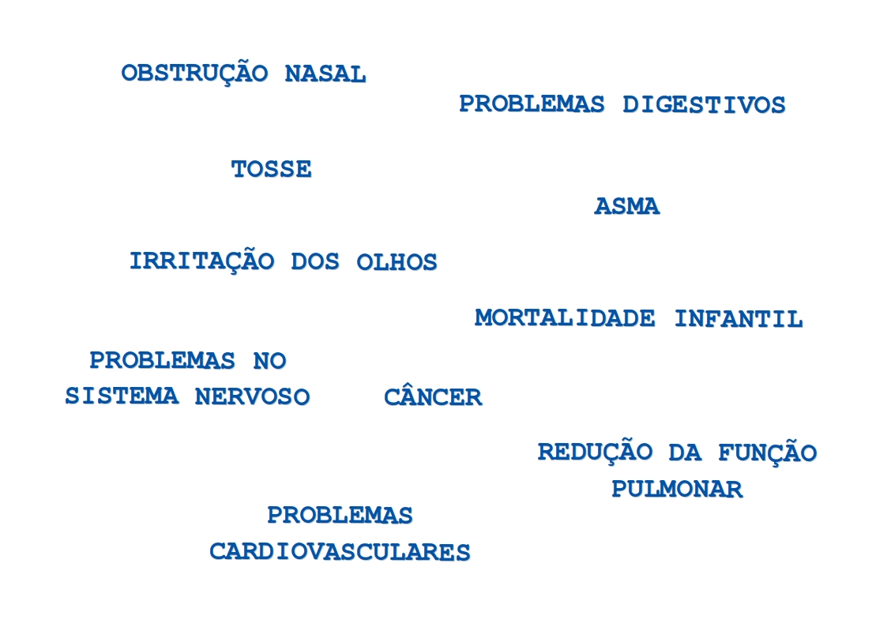
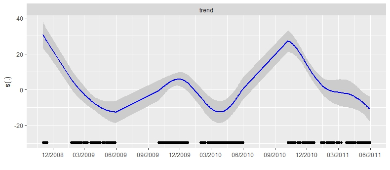

```{r setup, include=FALSE}
knitr::opts_chunk$set(echo = FALSE)
```

```{r}
library(magrittr)
```


# Estratégias para análise de dados de poluição do ar

# Poluição

##


## 

- NO, NO$_2$, CO, CO$_2$
- Ozônio
- PM 2.5 ou PM 10

## 

- A poluição do ar é o maior risco ambiental à saúde humana.
- Mata cerca de 7 milhões de pessoas por ano.

##



## 


# Dados de poluição do ar

## 

> **Concentração de poluentes**

- Medidas tempo-espaciais
- Positivas
- Geralmente assimétricas


## 

> **Estações CETESB**

- 22 estações espalhadas pela Grande São Paulo
- medições horárias de diversos poluentes
- [mapa](mapa_estacoes.html)


## 

> **Epidemiologia ambiental**

- mortalidade e casos de doenças
- dados de contagem
- pode haver excesso de zeros

## 

> **Covariáveis**

- uso de combustíveis
- dados meteorológicos
- dados de tráfego
- variáveis de calendário

##

> **Dificuldades de modelagem**

- distribuição mal especificada
- dados faltantes
- dados correlacionados
- valores defasados

# Exemplo

## Artigo A. Salvo e F. Geiger (2014)

[Reduction in local ozone levels in urban São Paulo due to a shift from ethanol to gasoline use](http://www.nature.com/ngeo/journal/v7/n6/full/ngeo2144.html)

## 

> **Cenário**

- Estudos apontando resultados contraditórios sobre a relação entre uso de etanol e concentração de ozônio.
- Mudança no uso de combustíveis gerada por flutuações em longa escala no preço do etanol relativo à gasolina.
- Proporção de carros à gasolina estimada por um modelo de demanda de consumo.
- Concentração de ozônio medida em 12 estações espalhadas pela Grande São Paulo.
- Período avaliado: 2009  a 2011.

## 

> **Análise**

- Concentração horária de ozônio vs proporção de carros à gasolina.
- Meses frios (junho a setembro) foram tirados da análise.
- Apenas dias úteis considerados.
- Um modelo para cada uma das 12 estações medidoras.
- Conclusão para a cidade: média das estimativas.

## 

> **Resultados**

- O aumento da proporção de carros à gasolina está associado à redução dos níveis de ozônio.
- Concentração de ozônio caiu cerca de 20% conforme a proporção de carros à gasolina subiu de 14 para 78%.

## 

> **Problemas**

- A proporção de carros à gasolina é uma variável estimada.
- Períodos sem informação:
    - dados faltantes
    - dias excluídos da análise.
- Componente espacial e temporal.
- Modelo linear é muito restritivo.

# Objetivos deste trabalho

##

- Discutir as dificuldades da análise de dados de poluição ar.
- Apresentar as principais metodologias para o ajuste desses dados.
- Introduzir a utilização de outras técnicas ou estratégias até então não consideradas neste contexto.

# Modelos lineares

##

\[
Y_t = \alpha + \beta_1 X_{1t} + \cdots + \beta_p X_{pt} + 
\]
\[
\hspace{2cm} + \gamma_1 Z_{1t} + \cdots + \gamma_s Z_{st} + \epsilon_t
\]

> **Suposições**

- $\epsilon_t \stackrel{\text{ind}}{\sim} N(0, \sigma^2)$
    - independência
    - homoscedasticidade
    - normalidade
- linearidade
- aditividade

## 

> **Vantagens**

- Facilidade de implementação.
- Facilidade de interpretação.
- Dados faltantes não geram maiores problemas no processo de estimação.

## 

> **Contornando as suposições**

- transformações em $Y$: homoscedasticidade e normalidade
- transformações em $X$: linearidade
- interações: aditividade

##

> **Tendência**

Termos do tipo:

\[
Z_{1t} = t, \quad t = 1, ..., n
\]

Transformações (diferenças):

\[
\Delta^j Y_t = \Delta[\Delta^{j-1} Y_t]
\]

##

> **Sazonalidade**

- Variáveis de calendário: hora, dia da semana, semana do ano, mês e ano.
   
# Modelos lineares generalizados

##

\[
Y_t|\mathbf{X_t},\mathbf{Z_t} \stackrel{ind}{\sim} \mathcal{D}(\mu_t, \phi)
\]

\[
g(\mu_t) = \alpha + \beta_1 X_{1t} + \cdots + \beta_p X_{pt} + \gamma_1 Z_{1t} + \cdots + \gamma_s Z_{st}
\]

> **Suposições**

- independência
- homoscedasticidade
- linearidade
- aditividade

##

> **Extensões**

- modelos lineares generalizados duplos
- modelos lineares generalizados mistos
- equações de estimação generalizadas


# Modelos aditivos generalizados

##

\[
Y_t|\mathbf{X_t},\mathbf{Z_t} \stackrel{ind}{\sim} \mathcal{D}(\mu_t, \phi)
\]

\[
g(\mu_t) = \beta_0 + f_1(X_{1t}) + \cdots + f_p(X_{pt}) + 
\]
\[
\hspace{2.3cm} + f_{p+1}(Z_{1t}) + \cdots + f_{p+s}(Z_{st})
\]

> **Suposições**

- independência
- homoscedasticidade
- aditividade


##

> **Funções e parâmetros de suavização**

- Existem diversas propostas para $f$:
    - splines naturais
    - splines suavizados
    - loess
    
- Como escolher os parâmetros
    - analiticamente
    - cross-validation

## Exemplo de função suavizada

Concentração de ozônio vs tempo



# Séries temporais

##

> **ARIMA**

\[
Y_t - \alpha_1 Y_{t-1} - \dots - \alpha_p Y_{t-p} = \epsilon_t + \theta_1 \epsilon_{t-1} + \dots + \theta_q\epsilon_{t-q}
\]

- $(\alpha_1, \dots, \alpha_p)$ os parâmetros do modelo auto-regressivo
- $(\theta_1, \dots, \theta_q)$ os parâmetros do modelo de médias móveis

##

> **Outras metodologias**

- SARIMA
- Periodogramas
- Função de autocorrelação parcial
- Análise espectral

# Outros tópicos

## 

> **Seleção de variáveis**

- Objetivo:
    - modelos mais parcimoniosos
    - redução da variância

- Alternativas:   
    - Stepwise
    - Regularização

##

> **Regularização**

- Regressão *ridge*
- LASSO

\[
L(\theta, \mathbf{x}) + \lambda\sum_{i=1}^{p} |\theta_i|
\]

##

> **Cross-validation**

- Estimar erro preditivo
- Cross-validation para séries temporais

##

> **Próximos passos**

- [Modelos geoestatísticos](mapa_model_VI.html)
- Modelos com erro de medida
- Aplicar a mais bancos de dados

## Obrigado!