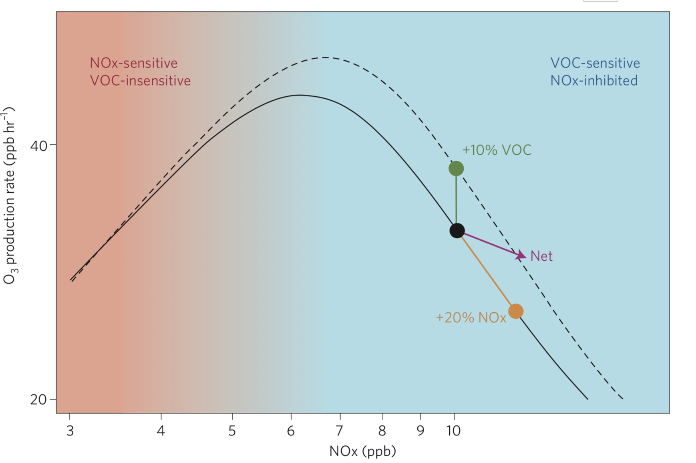

```{r setup, include=FALSE}
knitr::opts_chunk$set(echo = FALSE, message = FALSE, warning = FALSE)
```

# Sumário

- Poluição do ar
   - Contextulização
   - Pesquisa em poluição do ar
   
- Ciência de dados
   - Ciência de dados vs Estatística
   - O ciclo da ciência de dados
   
- Aplicação I: uso de etanol e concentração de ozônio

- Aplicação II: etanol, ozônio  e saúde pública

---
class: center, middle, inverse

# Poluição do ar

---


---
class: middle

.pull-left[

]

.pull-right[

]

---
class: middle, center


---

class: middle

.pull-left[

]

.pull-right[

]

---


---

# Interdisciplinaridade

- A dispersão dos poluentes da atmosfera é um processo **físico**, geralmente modelado por modelos **matemáticos**.

- A emissão dos compostos e a reação entre os gases da atmosfera são explicadas por equações **químicas**.

- Os níves de poluição são altamente correlacionados com as condições **meteorológicas**.

- Os equipamentos de medição dos poluentes são projetados por **engenheiros**.

- Os principais efeitos da poluição do ar estão na **saúde pública** e no **meio ambiente**.

- A análise do dados requer conhecimento de **estatística**.

---
class: center, middle, inverse

## Faltam estatísticas e estatísticos no mundo!

---

# Complexidade

- Problema muito mais complexo do que diz o senso comum.

- É preciso estudar muitas áreas do conhecimento.

- Geralmente estamos estudando a relação inerentemente complexa entre diversas variáveis.

--

- A flexibilidade do modelo é importante.

<br>

> Para todo problema complexo sempre existe uma solução simples, elegante e completamente errada.
>
> `r tufte::quote_footer('H. L. Mencken')`

---
class: center, middle, inverse

# Ciência de dados

---

# O que é?

- Um sinônimo de Estatística.

- Nome marketeiro para Estatística.

- Um nome mais amplo, que incorpora tarefas deixadas de lado pela Estatística. 
---

# Ciclo da ciência de dados


---

# Machine learning

- Termo criado em 1959.

--

- Existe um grande hype atualmente em cima desse termo (~50 artigos por dia no Arxiv!!!).

--

- Machine Learning é um nome (marketeiro) para modelagem preditiva.

--

- Machine Learning é uma abordagem de análise de dados que visa gerar a estimativa mais precisa possível para uma quantidade ou fenômeno (Max Kuhn, 2014).

---
class:: middle


---
class: center, middle, inverse

# Aplicações

---

# Uso de etanol e concentração de ozônio

- Devido à dependência de combustíveis fósseis, o setor de transporte é o mais resiliente aos esforços de redução de emissões.

- O bioetanol é considerado uma boa alternativa ao uso de gasolina:
    - fonte quase renovável;
    - a queima gera menos MP, NO<sub>x</sub>, CO e CO<sub>2</sub>.
    
- Pode ser utilizado puro ou como aditivo da gasolina.

---
class: middle, center


---

# Uso de etanol e concentração de ozônio

- Embora o etanol seja considerado um combustível menos poluente, alguns estudos recentes sugerem associação entre o uso de etanol e o aumento da concentração de ozônio.

- Reduction in local ozone levels in urban São Paulo due to a shift from ethanol to gasoline use --- Salvo e Geiger, 2014

- Reduced ultrafine particle levels in São Paulo's atmosphere during shifts from gasoline to ethanol use --- Salvo et al 2017

---
class: middle, center


---

# Estudo

- **Hipótese**: a média diária da concentracão de ozônio (medida entre 12h e 16h) está associada com a proporção de carros a gasolina (entre os veículos bicombustíveis).

- **Local**: Região Metropolitana de São Paulo.

- **Período**: novembro de 2008 a maio de 2013.

- **Amostra**: 13203 dias.

---
class: middle, center


---
class: center, middle


---

### Estações de monitoramento

<center>
```{r, fig.align='center'}
library(magrittr)
df <- readxl::read_excel("../data/cetesb_station_geoposition.xlsx") %>% 
  dplyr::slice(1:6, 11, 14, 17, 18, 19, 20)

df %>%
  leaflet::leaflet() %>%
  leaflet::addTiles() %>%
  leaflet::addCircleMarkers(lng = ~long, lat = ~lat, popup = ~stationname)
```
</center>

---
class: center, middle

$$y = \beta_0 + \beta_{\textrm{prop}}X_p + \beta_{\textrm{clima}}X_c + \beta_{\textrm{trânsito}}X_t + \beta_{\textrm{calendário}}X_{ca} + \epsilon$$

---
class: center, middle

### A concentração média do ozônio troposférico caiu cerca de <br> 8.3 $\mu$g/m³ conforme a proporção de carros a gasolina subiu de <br> 30 para 80%.

---
class: center, middle


--


---
class: center, middle



---
class: center, middle

```{r}
tibble::tibble(
  share = seq(0.2, 0.9, 0.01),
  o3 = -16.65661*share
) %>% 
  ggplot2::ggplot(ggplot2::aes(x = share, y = o3)) +
  ggplot2::geom_line() +
  ggplot2::geom_vline(xintercept = 0.3, linetype = 2) +
  ggplot2::geom_vline(xintercept = 0.8, linetype = 2) +
  ggplot2::labs(
    x = "Proporção de carros a gasolina",
    y = "Variação na concentração de ozônio"
  ) +
  ggplot2::theme_minimal()
```

---
class: middle, center

Modelo aditivo generalizado:

$$y = \beta_0 + s(X_{\textrm{prop}}) + s(X_{\textrm{clima}}) + \beta_{\textrm{trânsito}}X_t + \beta_{\textrm{calendário}}X_{ca} + \epsilon$$
---
class: middle, center

<video width="400" controls Autoplay=autoplay>
  <source src="imagens/loes-gif.mov" type="video/mp4">
</video>

---
class: middle, center


---
class: middle, center

### Random forest


---
class: middle, center

### XGBoost


---
class: middle, center

### XGBoost (clima)


---
# Desempenho dos modelos

```{r}
tibble::tibble(
  Modelo = c("XGBoost", "Floresta aleatória", "GAM", "Salvo et al."),
  RMSE = c(12.24,  14.11, 19.82, 19.75),
  R2 = c(88.56, 85.72, 70.50, 70.19),
  `Variáveis mais importantes` = c("Temperatura, umidade, radiação, tendência e vento", "Temperatura, umidade, radiação, tendência e vento", "Temperatura, vento, umidade, radiação e tendência", "Temperatura, velocidade do vento, radiação, umidade e var. ind. estação São Caetano do Sul")
) %>% 
  knitr::kable(format = "html", align = c("l", "c", "c", "c"))
```


---


# Etanol, ozônio e saúde pública

---

# Referências

### Saara, plumas de poeira e saúde

- [The Effects of African Dust on Coral Reefs and Human Health](https://archive.usgs.gov/archive/sites/coastal.er.usgs.gov/african_dust/)

- [Saharan dust versus Atlantic hurricanes ](https://earthdata.nasa.gov/user-resources/sensing-our-planet/saharan-dust-versus-atlantic-hurricanes)
