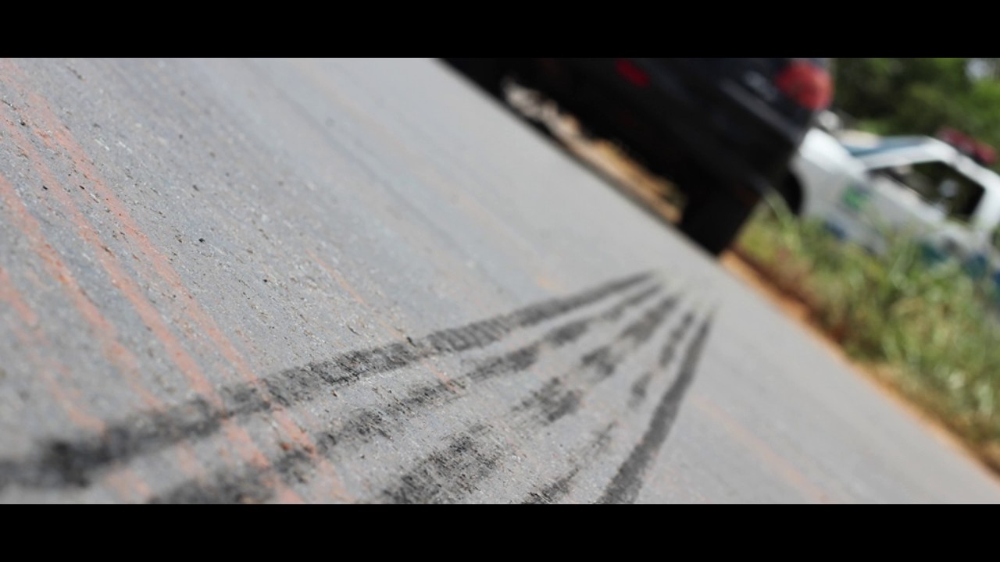
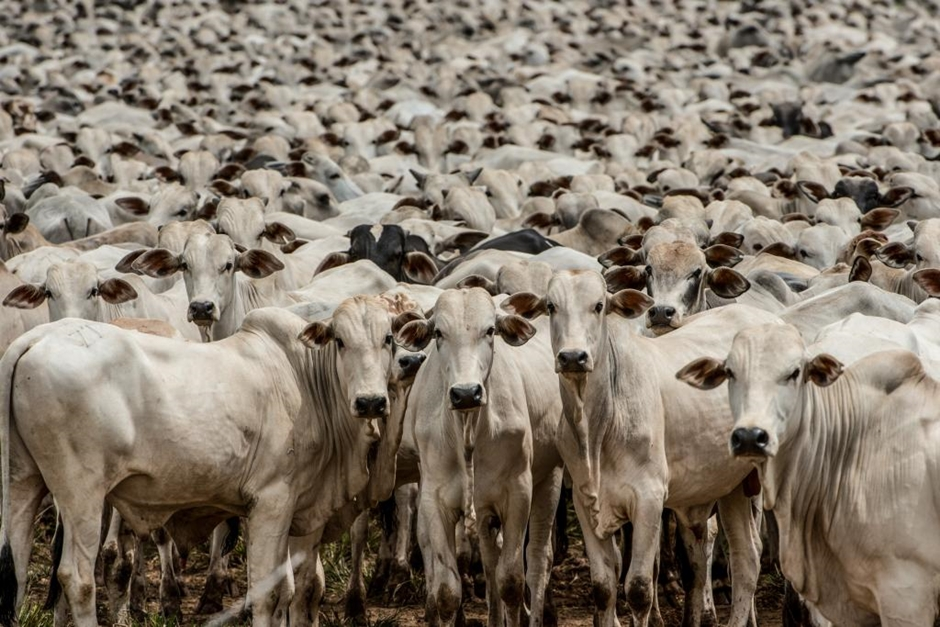

```{r setup, include=FALSE}
knitr::opts_chunk$set(echo = TRUE)
```

# Sumário

- Poluição do ar
   - Contextulização
   - Pesquisa em poluição do ar
   
- Ciência de dados
   - Ciência de dados vs Estatística
   - O ciclo da ciência de dados
   
- Aplicação I: uso de etanol e concentração de ozônio

- Aplicação II: etanol, ozônio  e saúde pública

---
class: center, middle, inverse

# Poluição do ar

---


---
class: middle

.pull-left[

]

.pull-right[

]

---
class: middle



---

class: middle

.pull-left[

]

.pull-right[

]

---


---

# Interdisciplinaridade

- A dispersão dos poluentes da atmosfera é um processo **físico**, geralmente modelado por modelos **matemáticos**.

- A emissão dos compostos e a reação entre os gases da atmosfera são explicadas por equações **químicas**.

- Os níves de poluição são altamente correlacionados com as condições **meteorológicas**.

- Os equipamentos de medição dos poluentes são projetados por **engenheiros**.

- Os principais efeitos da poluição do ar estão na **saúde pública** e no **meio ambiente**.

- A análise do dados requer conhecimento de **estatística**.

---
class: center, middle, inverse

## Faltam estatísticas e estatísticos no mundo!

---

# Complexidade

- Problema muito mais complexo do que diz o senso comum.

- É preciso estudar muitas áreas do conhecimento.

- Geralmente estamos estudando a relação inerentemente complexa entre diversas variáveis.

--

- Modelos simples serão suficientes?

---
class: center, middle, inverse

# Ciência de dados

---

# O que é?

- Um sinônimo de Estatística.

- Nome marketeiro para Estatística.

- Um nome mais amplo, que incorpora tarefas deixadas de lado pela Estatística. 
---

# Ciclo da ciência de dados


---

# Machine learning

- Termo criado em 1959.

--

- Existe um grande hype atualmente em cima desse termo (~50 artigos por dia no Arxiv!!!).

--

- Machine Learning é um nome (marketeiro) para modelagem preditiva.

--

- Machine Learning é uma abordagem de análise de dados que visa gerar a estimativa mais precisa possível para uma quantidade ou fenômeno (Max Kuhn, 2014).

---
class:: middle


---
class: center, middle, inverse

# Aplicações

---

# Uso de etanol e concentração de ozônio

---

# Etanol, ozônio e saúde pública

---

# Referências

### Saara, plumas de poeira e saúde

- [The Effects of African Dust on Coral Reefs and Human Health](https://archive.usgs.gov/archive/sites/coastal.er.usgs.gov/african_dust/)

- [Saharan dust versus Atlantic hurricanes ](https://earthdata.nasa.gov/user-resources/sensing-our-planet/saharan-dust-versus-atlantic-hurricanes)
