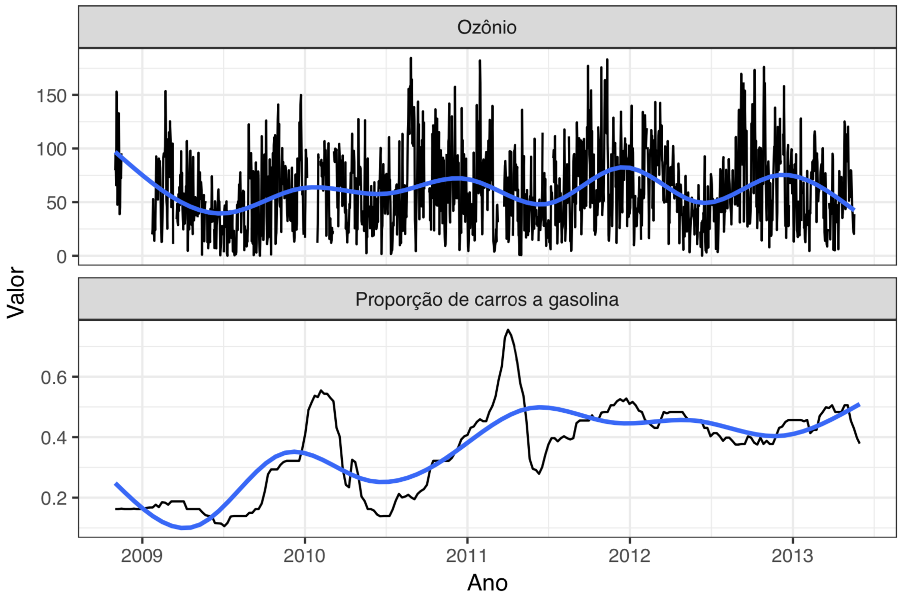
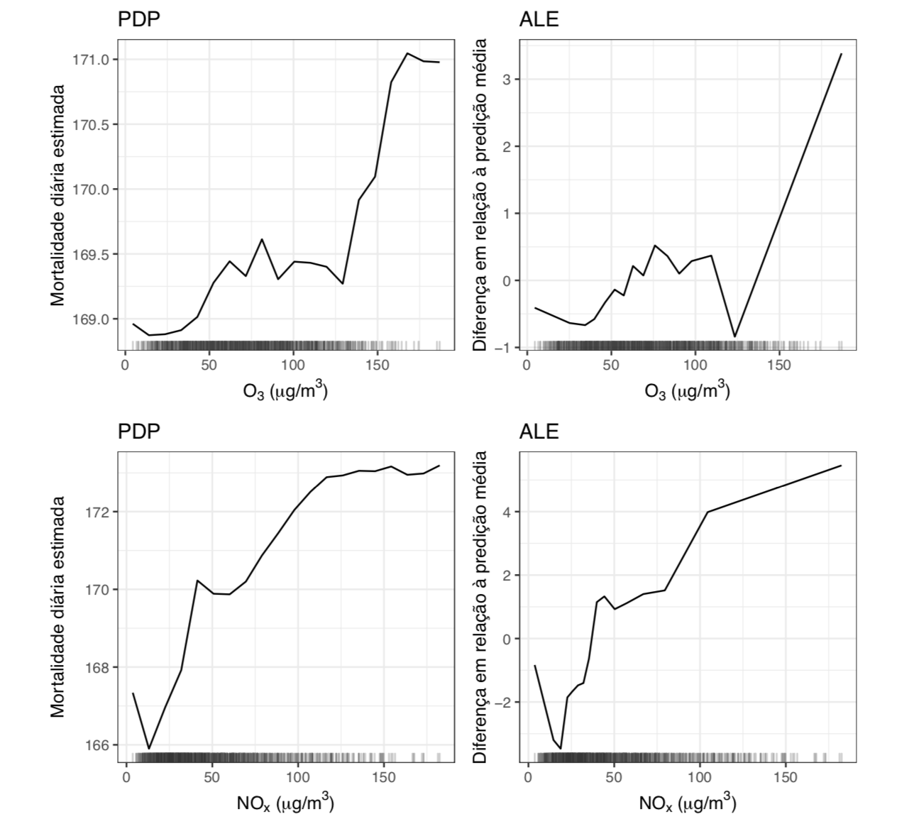

```{r setup, include=FALSE}
knitr::opts_chunk$set(echo = FALSE, message = FALSE, warning = FALSE)
```

# Sumário

--

- Poluição do ar é um problema complexo.
    - Motivação da tese e como funciona a pesquisa em poluição do ar

--

- Estatística é difícil.
    - Técnicas utilizadas no trabalho e por que estatística não é só rodar modelo.

--

- Problemas complexos não têm soluções simples. 
    - Aplicação das técnicas aos problemas de poluição.

---
class: center, middle, inverse

# Poluição do ar

---


---
class: middle

.pull-left[

]

.pull-right[

]

---
class: middle, center


---

class: middle

.pull-left[

]

.pull-right[

]

---


---

# Interdisciplinaridade

- A dispersão dos poluentes da atmosfera é um processo **físico**, geralmente modelado por modelos **matemáticos**.

- A emissão dos compostos e a reação entre os gases da atmosfera são explicadas por equações **químicas**.

- Os níveis de poluição são altamente correlacionados com as condições **meteorológicas**.

- Os equipamentos de medição dos poluentes são projetados por **engenheiros**.

- Os principais efeitos da poluição do ar estão na **saúde pública** e no **meio ambiente**.

- A análise do dados requer conhecimento de **estatística**.

---

# Em resumo...

- Problema muito mais complicado do que diz o senso comum.

- É preciso estudar muitas áreas do conhecimento.

- A relação entre as variáveis é inerentemente complexa.

--

<br>

- Poluição do ar é um problema complexo.

<br>

---
class: center, middle, inverse

# Ciência de dados

---

# O que é?

- Um sinônimo de Estatística.

- Nome marqueteiro para Estatística.

- Um conceito mais amplo, que incorpora tarefas deixadas de lado pela Estatística. 
---

# Ciclo da ciência de dados


---

# Machine learning

--

- Termo criado em 1959.

--

- Machine Learning é um nome (marqueteiro) para modelagem preditiva.

--

- Machine Learning é uma abordagem de análise de dados que visa gerar a estimativa mais precisa possível para uma quantidade ou fenômeno (Max Kuhn, 2014).

---
class:: middle


---

## Do Machine learning para a inferência

- Modelos mais flexíveis

- Validação cruzada

- Métodos de interpretação

---
class:: middle, center


---
class:: middle, center


---
class:: middle, center


<!-- --- -->
<!-- class:: middle, center -->

<!--  -->

---
class: center, middle, inverse

# Aplicações

---

# Uso de etanol e concentração de ozônio

- Devido à dependência de combustíveis fósseis, o setor de transporte é o mais resiliente aos esforços de redução de emissões.

- O bioetanol é considerado uma boa alternativa ao uso de gasolina:
    - fonte quase renovável;
    - a queima gera menos MP, NO<sub>x</sub>, CO e CO<sub>2</sub>.
    
- Pode ser utilizado puro ou como aditivo da gasolina.

---
class: middle, center


---

# Uso de etanol e concentração de ozônio

- Embora o etanol seja considerado um combustível menos poluente, alguns estudos recentes sugerem associação entre o uso de etanol e o aumento da concentração de ozônio.

- *Reduction in local ozone levels in urban São Paulo due to a shift from ethanol to gasoline use* (Salvo e Geiger, 2014)

- *Reduced ultrafine particle levels in São Paulo's atmosphere during shifts from gasoline to ethanol use* (Salvo et al 2017)

---
class: middle, center


---

# Estudo

- **Hipótese**: a média diária da concentração de ozônio (medida entre 12h e 16h) está associada com a proporção de carros a gasolina (entre os veículos bicombustíveis).

- **Local**: Região Metropolitana de São Paulo.

- **Período**: novembro de 2008 a maio de 2013.

- **Amostra**: 13203 dias.

---
class: middle, center



---
class: center, middle


---

### Estações de monitoramento

<center>
```{r, fig.align='center'}
library(magrittr)
df <- readxl::read_excel("../data/cetesb_station_geoposition.xlsx") %>% 
  dplyr::slice(1:6, 11, 14, 17, 18, 19, 20)

df %>%
  leaflet::leaflet() %>%
  leaflet::addTiles() %>%
  leaflet::addCircleMarkers(lng = ~long, lat = ~lat, popup = ~stationname)
```
</center>

---
class: center, middle

$$y = \beta_0 + \beta_{\textrm{prop}}X_p + \beta_{\textrm{met.}}X_{m} + \beta_{\textrm{trânsito}}X_t + \beta_{\textrm{calendário}}X_{c} + \beta_{\textrm{estação}}X_{e} + \epsilon$$

---
class: center, middle

### A concentração média do ozônio troposférico caiu cerca de <br> 8.3 $\mu$g/m³ conforme a proporção de carros a gasolina subiu de <br> 30 para 80%.

---
class: center, middle


--


---
class: center, middle

```{r}
tibble::tibble(
  share = seq(0.2, 0.9, 0.01),
  o3 = -16.65661*share
) %>% 
  ggplot2::ggplot(ggplot2::aes(x = share, y = o3)) +
  ggplot2::geom_line() +
  ggplot2::geom_vline(xintercept = 0.3, linetype = 2) +
  ggplot2::geom_vline(xintercept = 0.8, linetype = 2) +
  ggplot2::labs(
    x = "Proporção de carros a gasolina",
    y = "Variação na concentração de ozônio"
  ) +
  ggplot2::theme_minimal()
```

---
class: middle, center

Modelo aditivo generalizado:

$$y = \beta_0 + s(X_{\textrm{prop}}) + s(X_{\textrm{met.}}) + \beta_{\textrm{trânsito}}X_t + \beta_{\textrm{calendário}}X_{c} + \beta_{\textrm{estação}}X_{e} + \epsilon$$
---
class: middle, center

<video width="400" controls Autoplay=autoplay>
  <source src="imagens/loes-gif.mov" type="video/mp4">
</video>

---
class: middle, center


---
class: middle, center

### Random forest


---
class: middle, center

### XGBoost


---
class: middle, center

### XGBoost (clima)


---
# Desempenho dos modelos

<br>

```{r}
tibble::tibble(
  Modelo = c("XGBoost", "Floresta aleatória", "GAM", "Salvo et al."),
  RMSE = c(12.24,  14.11, 19.82, 19.75),
  R2 = c(88.56, 85.72, 70.50, 70.19),
  `Variáveis mais importantes` = c("Temperatura, umidade, radiação, tendência e vento", "Temperatura, umidade, radiação, tendência e vento", "Temperatura, vento, umidade, radiação e tendência", "Temperatura, velocidade do vento, radiação, umidade e var. ind. estação São Caetano do Sul")
) %>% 
  knitr::kable(format = "html", align = c("l", "c", "c", "c"))
```

---
class: middle, center


---

# Outros resultados e conclusão

- Modelos de regressão segmentada

- Modelos aditivos generalizados com outras distribuições

- LASSO

- Modelo para cada estação

--

<br>

- Embora a maioria dos modelos sugira uma redução na concentração do ozônio com o aumento na proporção de carros a gasolina, ainda não é clara qual é de fato a relação entre essas variáveis.

---

# Etanol, ozônio e saúde pública

A poluição do ar está associada com diversos problemas de saúde pública:

- doenças respiratórias e cardiovasculares;

- problemas digestivos e no sistema nervoso;

- câncer;

- aumento da mortalidade infantil.

---
class: middle, center

### Será que a variação da proporção de carros a gasolina tem algum efeito na saúde pública?

---

## Estudo

- Dados de mortalidade do Sistema de Informações de Mortalidade (SIM) do DATASUS:
    - mortalidade geral
    - mortalidade por doenças cardiopulmonares (câncer de pulmão, doenças do aparelho circulatório e doenças do aparelho respiratório)
    
- **Período**: novembro de 2008 a maio de 2013.

- **Local**: cidade de São Paulo.

- **Grupos**: crianças ( $\leq$ 5 anos) e idosos ( $\geq$ 60 anos).

- **Variáveis de controle**:
    - temperatura e umidade;
    - dia da semana, mês, indicador de dia útil e tendência (linear);
    - proporção de carros a gasolina.

---
class: middle, center


---
### Resultados (proporção de carros a gasolina)

<br>
<br>
<center>

</center>

---
class: middle, center


---
class: middle, center


---

class: middle, center

Vamos considerar agora as concentração de ozônio e óxidos de nitrogênio como preditores.

---

class: middle, center


---

class: middle, center



---
class: middle, center

### Também ajustamos o modelo para a série defasada (1 dia)


---

# Outros resultados e conclusões

- XGBoost

- Modelo para a relação entre NOx e ozônio.

- Modelo para mortalidade por doenças cardiopulmonares

--
<br>

- Não é muito clara a relação entre a proporção de carros a gasolina e a mortalidade.

- A concentração de ozônio e NOx parecem estar positivimante associadas com a mortalidade.

- O melhor modelo foi aquele com concentração dos poluentes defasada em um dia.

---

# Conclusões gerais

- Este tabalho é uma ponte entre a Estatística e a área de estudos em Poluição do ar.

- A Ciência de Dados e o Machine Learning precisam fazer parte do repertório de quem trabalha com análise de dados.

- Devemos tomar cuidado para que as suposições do modelo escolhido não limitem o conhecimento que podemos extrair dos dados.

---

# Referências

### Poluição

- [How Much CO2 Does A Single Volcano Emit?](https://www.forbes.com/sites/startswithabang/2017/06/06/how-much-co2-does-a-single-volcano-emit/#48fd71815cbf)

- [Methane emissions from cattle are 11% higher than estimated](https://www.theguardian.com/environment/2017/sep/29/methane-emissions-cattle-11-percent-higher-than-estimated)

- [The Effects of African Dust on Coral Reefs and Human Health](https://archive.usgs.gov/archive/sites/coastal.er.usgs.gov/african_dust/)

- [Saharan dust versus Atlantic hurricanes ](https://earthdata.nasa.gov/user-resources/sensing-our-planet/saharan-dust-versus-atlantic-hurricanes)

### Estatística

- [Introduction to Statistical Learning](http://www-bcf.usc.edu/~gareth/ISL/)

- [Elements of Statistical Learning](https://web.stanford.edu/~hastie/ElemStatLearn/)

- [Interpretable Machine Learning](https://christophm.github.io/interpretable-ml-book/agnostic.html)

---

# Github

- [Repositório da tese](https://github.com/williamorim/tese)
